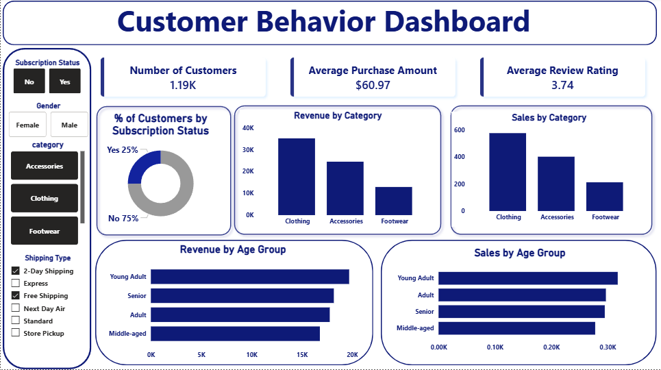

# 📊 Customer Shopping Behavior Analysis

## 🧾 Project Overview

This project analyzes **customer shopping behavior** using transactional data from **3,900 purchases** across multiple product categories.  

The objective is to uncover insights into:
- 💰 Spending patterns  
- 👥 Customer segmentation  
- 🛍️ Product preferences  
- 🎯 Subscription behavior  

These insights help support **data-driven business decisions** and strategic planning.

---

## 📁 Dataset Summary

- **Total Rows:** 3,900  
- **Total Columns:** 18  

### Key Features:
- **Customer Demographics:** Age, Gender, Location, Subscription Status  
- **Purchase Details:** Item Purchased, Category, Purchase Amount, Season, Size, Color  
- **Shopping Behavior:** Discount Applied, Promo Code Used, Previous Purchases, Frequency of Purchases, Review Rating, Shipping Type  

### ⚠️ Data Quality:
- Missing values in **Review Rating**: 37 entries  

---

## 🧹 Data Preparation & Feature Engineering (Python)

- Imported dataset using `pandas`  
- Cleaned missing values  
- Created new features:
  - `age_group` (customer segmentation by age)
  - `purchase_frequency_days` (behavioral analysis)  
- Removed redundant column:
  - `promo_code_used`  
- Loaded cleaned dataset into **PostgreSQL** for advanced SQL analysis  

---

## 🧠 SQL Analysis & Key Insights

### 💰 Revenue Analysis

- **Male Customers:** $157,890  
- **Female Customers:** $75,191  

---

### 💸 Discount & Spending Behavior

- **High-Spending Discount Users:** 839 customers spent above average despite using discounts  

- **Discount-Dependent Products:**
  - Hat → 50%  
  - Sneakers → 49.66%  
  - Coat → 49.07%  

---

### ⭐ Product Performance

- **Top Rated Products:**
  - Gloves → 3.86  
  - Sandals → 3.84  
  - Boots → 3.82  

---

### 🚚 Shipping Analysis

- **Express Shipping:** $60.48  
- **Standard Shipping:** $58.46  

---

### 👥 Subscription Analysis

- **Subscribers:**
  - 1,053 customers  
  - Avg spend: $59.49  
  - Revenue: $62,645  

- **Non-Subscribers:**
  - 2,847 customers  
  - Avg spend: $59.87  
  - Revenue: $170,436  

---

### 🧑‍🤝‍🧑 Customer Segmentation

- **Loyal:** 3,116  
- **Returning:** 701  
- **New:** 83  

---

### 🛍️ Top Products by Category

- **Accessories:** Jewelry, Sunglasses, Belt  
- **Clothing:** Blouse, Pants, Shirt  
- **Footwear:** Sandals, Shoes, Sneakers  
- **Outerwear:** Jacket, Coat  

---

### 🔁 Repeat Buyers & Subscriptions

- **Repeat Buyers Distribution:**
  - Subscribers: 958  
  - Non-subscribers: 2,518  

---

### 📊 Revenue by Age Group

- **Young Adult:** $62,143  
- **Middle-aged:** $59,197  
- **Adult:** $55,978  
- **Senior:** $55,763  

---

## 📊 Power BI Dashboard

An interactive dashboard was built using **Power BI** to visualize key insights and support data-driven decision-making.

### 📸 Dashboard Preview

---

### 🔑 Key Metrics:
- 👥 Total Customers: 3.9K  
- 💰 Average Purchase Amount: $59.76  
- ⭐ Average Review Rating: 3.75  

### 📈 Visual Insights:
- Customer distribution by subscription status  
- Revenue & sales by category  
- Revenue by age group  
- Shipping type analysis with filters

---

## 💡 Business Recommendations

- **Boost Subscriptions:** Offer exclusive benefits to increase subscriber base  
- **Customer Loyalty Programs:** Strengthen engagement with repeat buyers  
- **Optimize Discount Strategy:** Balance discounts with profit margins  
- **Highlight Top Products:** Promote best-selling and highly rated items  
- **Targeted Marketing:** Focus on high-value age groups and shipping preferences  

---

## 🚀 Tech Stack

- Python (Pandas, NumPy)  
- SQL (PostgreSQL)  
- Power BI  
- Jupyter Notebook  

---

## 🎯 Key Learnings

- Data cleaning & feature engineering  
- SQL aggregation and window functions  
- Customer segmentation techniques  
- Data storytelling & dashboard design  
- End-to-end analytics workflow  
